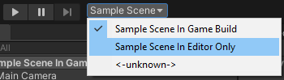

# Quick Scene Selection

Provides a drop-down on toolbar that quickly select scenes in build list

## Importing

To use this in your Unity project import it from Unity Package Manager. You can [download it and import it from your hard drive](https://docs.unity3d.com/Manual/upm-ui-local.html), or [link to it from github directly](https://docs.unity3d.com/Manual/upm-ui-giturl.html).

## How To use

First, open **Build Settings** panel from **File->Build Settings...**

Next, Add your scenes to the list, include both scenes in your build and scene in editor time only (uncheck it from build).

Now, you can change scene by selecting scene from drop-down next to Play/Pause/Next group buttons.

